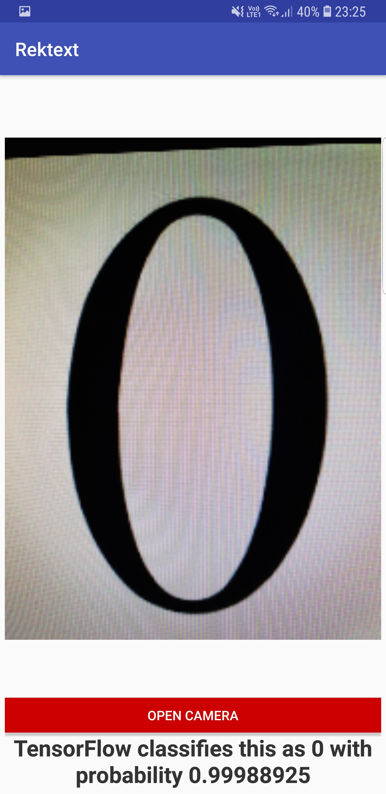
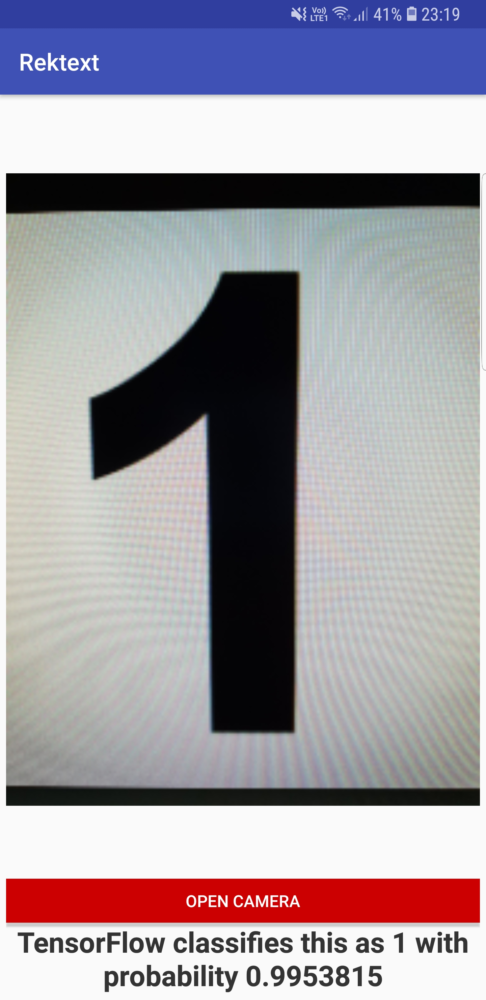
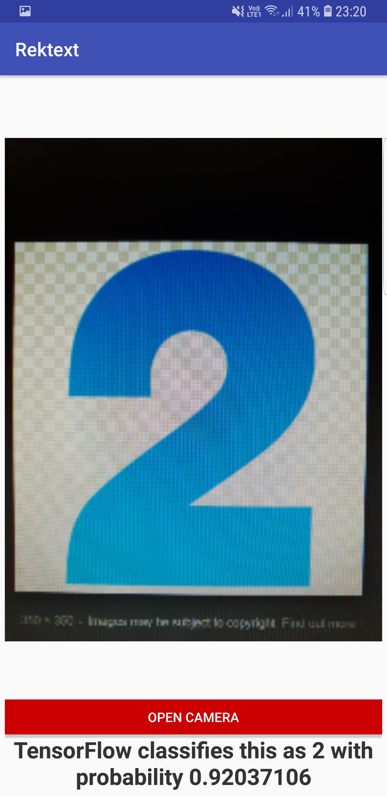
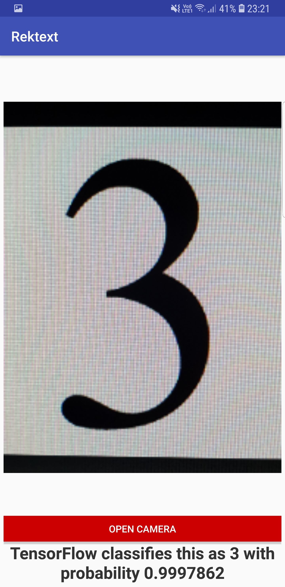
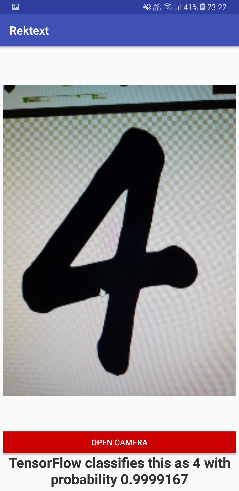
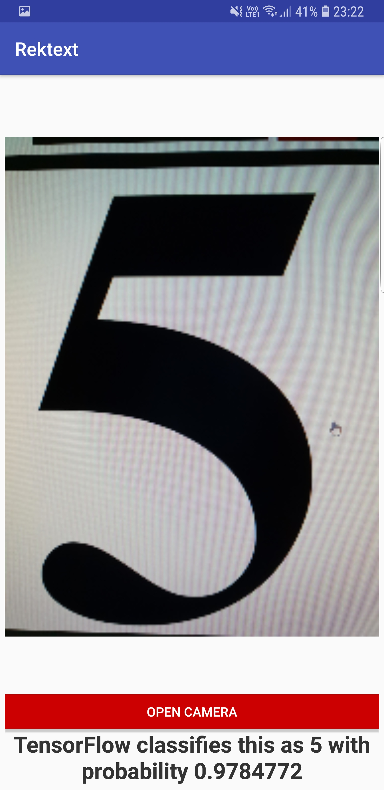
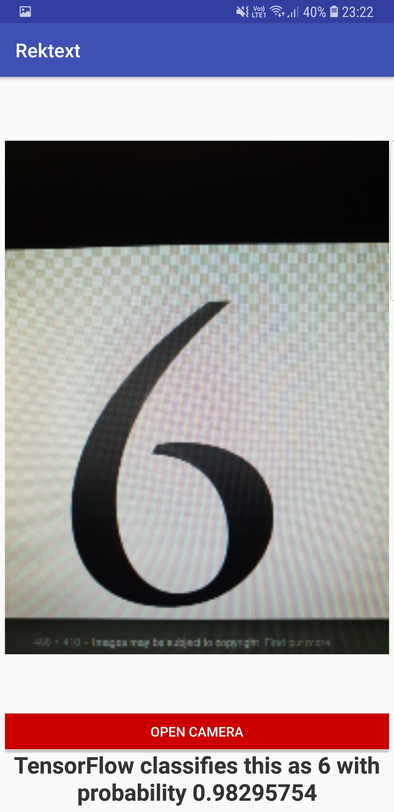
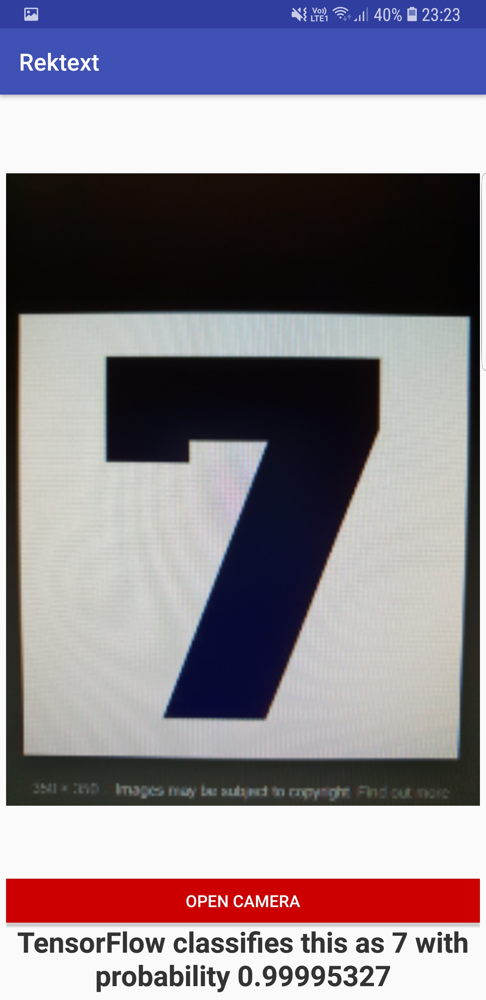
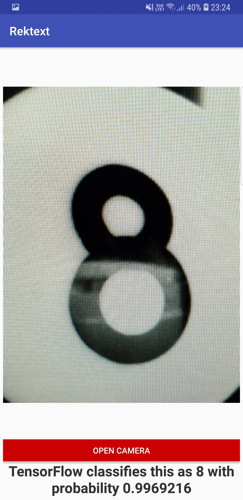
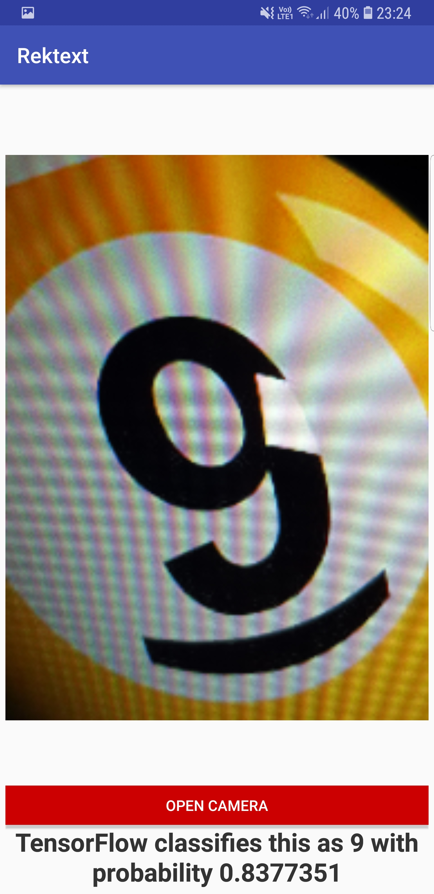

# Rektext : Recognise text on Android

Android app, trained using deep CNN's on the SVHN dataset, which takes an input from camera and (for now) recognises numerical digit present (0 through 9).

### Python 3 used for DL model.
### Min SDK version: 15
### Target SDK version: 26

# Overview

Currently Rektext recognises digits from 0 to 9 (printed, real world digits are the best use case). I wanted to make a model and then be able to apply it in the real world without too much hasle hence the idea for making an app.
Could have used the MNIST dataset, but it seemed too mainstream.
The SVHN dataset is the next step from MNIST towards applying CNN's to real world applications, due to the nature of this dataset it seemed best suited for this app.
Rektext best works on real world printed images, and will perform better if the digits covers most of the image.

Demo images :

Printed digits classification from SVHN on Android with TensorFlow.

## Dataset used - pre requisite
The very popular SVHN dataset from Stanford is used to train the CNN model used. The dataset can be found [here](http://ufldl.stanford.edu/housenumbers/).
The download labelled "Format 2" has been used which comprises of 32x32 images of cropped digits. (in 3 ".mat" files)
These files are then used to make float32 arrays and eventually train the model.

###IMP : Make sure you have the datasets downloaded in the specified directory for the python code to work.

## Model overview
The images are first converted to greyscale to reduce training time and GPU load.
The structure for the deep learning model is:

INPUT -> [CONV -> RELU -> CONV -> RELU -> POOL] -> DROPOUT -> [FC -> RELU] -> FC

It took about 3 minutes to run 50,000 iterations on a GTX 1070.
This model can be *easily* tuned to recognise strings of digits as well.
The output from the python notebook is the Protocol Buffer file, which is then imported into the assets directory of the Android app.

## Dependencies

All included in the gradle.build file. (TensorFlow dependency for Android)

## Usage

Ready to run project in the Android directory. Open with Android Studio.

### Interacting with TensorFlow

To interact with TensorFlow you will need an instance of TensorFlowInferenceInterface, you can see more details about it [here](https://github.com/mari-linhares/mnist-android-tensorflow/blob/master/MnistAndroid/app/src/main/java/mariannelinhares/mnistandroid/Classifier.java)

## Credits

There are multiple sources which helped me develop this app.

First and foremost [this repo](https://github.com/thomalm/svhn-multi-digit) by Thomas is the core of the Deep Learning model.
Secondly [this video](https://www.youtube.com/watch?v=kFWKdLOxykE) by Siraj on Youtube is how I learnt to use TF on Android. Big thanks to him, check out his videos if you're into ML/DL.

### Any improvements/suggestions/queries are more than welcome.